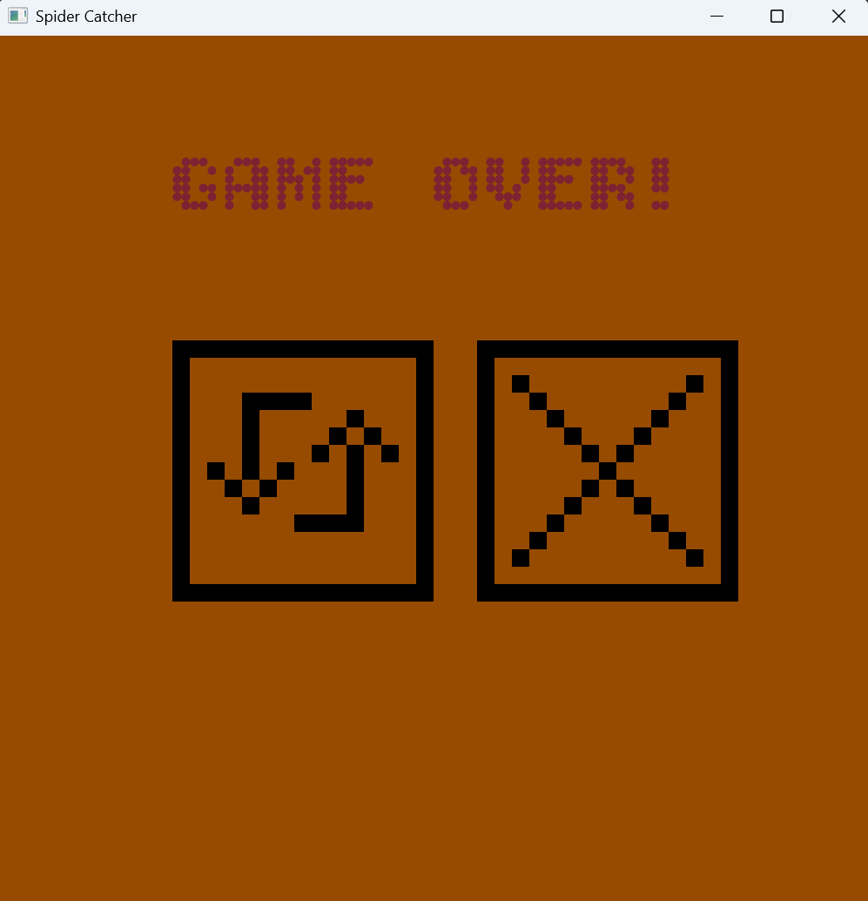
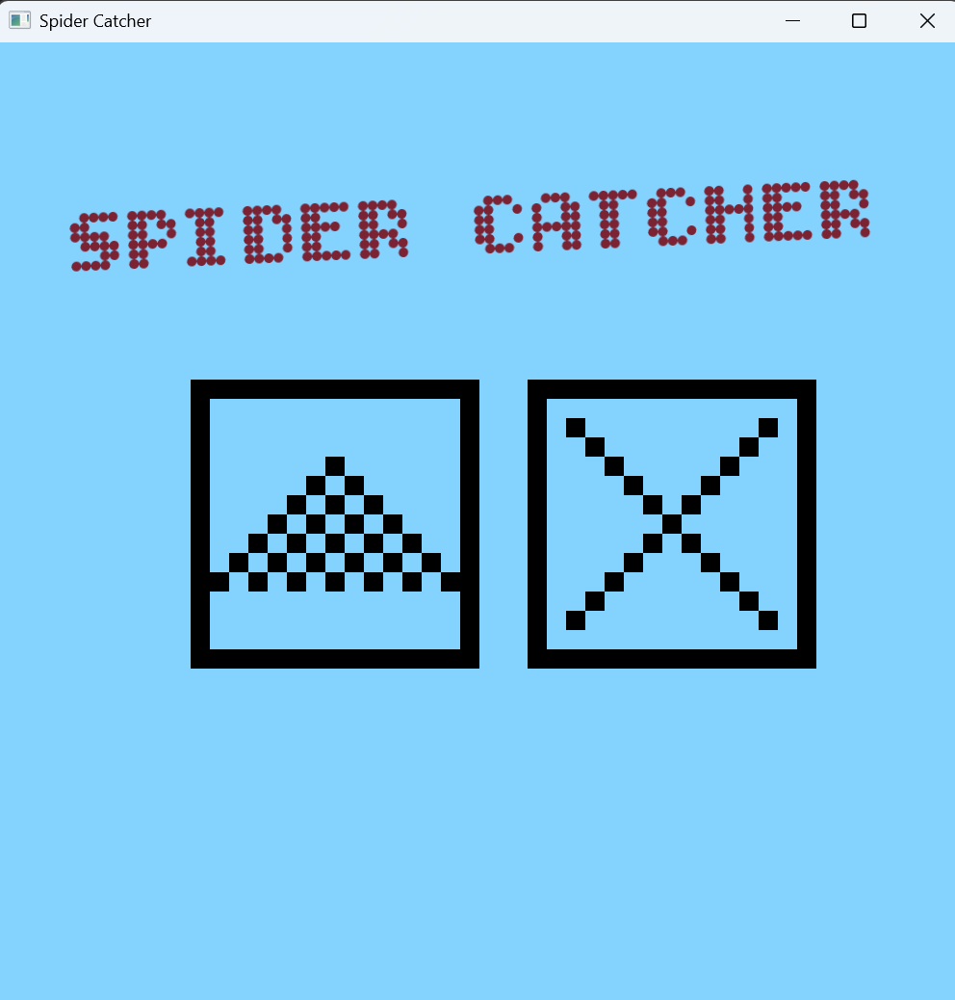
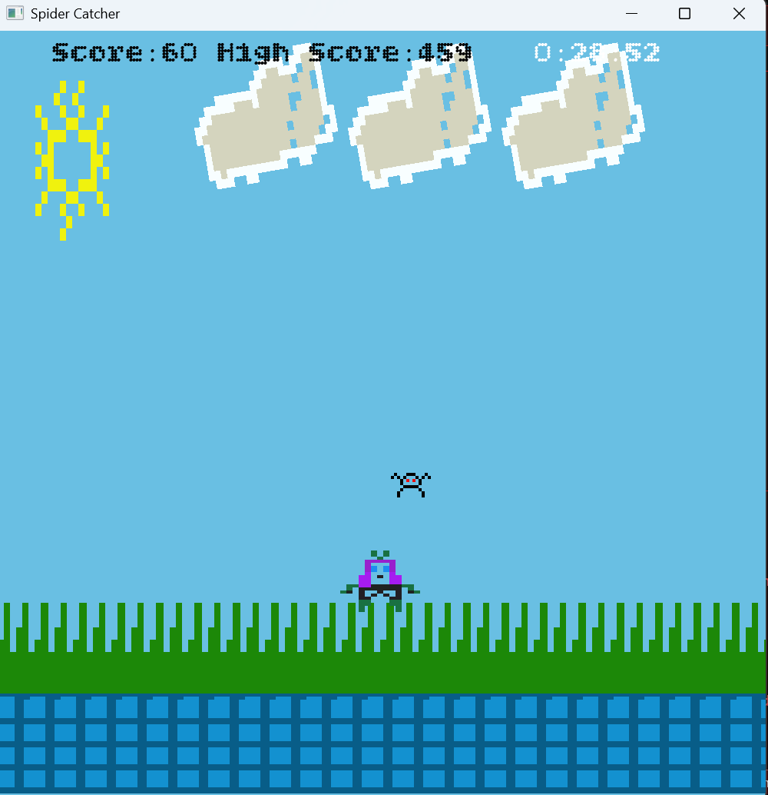

````markdown
# 🕷️ SpiderCatcher

**SpiderCatcher** is a fast-paced **2D arcade-style game** built with **C++** and **SFML (Simple and Fast Multimedia Library)**.
Your goal: **catch as many spiders as possible within 60 seconds!**

All game assets — art and sound — were created from scratch using **Piskel** and **Beatbox**.

---

## 🎮 Gameplay

Move swiftly and catch spiders before they vanish!
Each catch increases your score. The challenge? A strict 60-second timer.

### 🕹️ Controls

| Action | Keys |
|--------|------|
| Move Left | `←` or `A` |
| Move Right | `→` or `D` |
| Jump | `↑`, `W`, or `Spacebar` |

Your reflexes and timing decide how many spiders you can catch before time runs out!

---

## ✨ Features

- 🕸️ Catch as many spiders as you can in 60 seconds
- 🕹️ Smooth player movement and jumping mechanics
- 🎨 Custom-made pixel art using **Piskel**
- 🔊 Original sound effects created with **Beatbox**
- ⚙️ Lightweight build — runs under 20 MB
- 💻 Cross-platform support (Windows, Linux, macOS)
- 🧩 Built using **C++** and **SFML**

---

## 🖥️ Installation & Running

### 🪟 **Windows (Prebuilt Executable)**

1. Download the folder **`SpiderCatcher(WIN32)`** from the release or repository.
2. Run `SpiderCatcher.exe`.
   ✅ *No compilation required.*

---

### 🐧 **Other Platforms (Linux / macOS)**

You’ll need to compile from source.

1.  **Clone the Repository**
    ```bash
    git clone [https://github.com/unperturbable-se/SpiderCatcher.git](https://github.com/unperturbable-se/SpiderCatcher.git)
    cd SpiderCatcher
    ```

2.  **Configure SFML Path**

    Open `CMakeLists.txt` and locate this line:

    ```cmake
    set(SFML_DIR "")
    ```

    Replace it with your actual SFML installation path, for example:

    ```cmake
    set(SFML_DIR "/usr/local/SFML")
    ```

3.  **Build the Project**
    ```bash
    cmake .
    make
    ```

4.  **Run the Game**
    ```bash
    ./SpiderCatcher
    ```

#### ⚙️ Notes

* The build system automatically links the required SFML modules (graphics, window, audio, system).
* On Windows, DLLs are copied automatically after build (see `CMakeLists.txt`).
* On other platforms, ensure SFML is installed and its path is correctly set.

---

## 🧱 Tools & Technologies

| Purpose | Tool |
|----------|------|
| Game Engine / Framework | **SFML** |
| Language | **C++** |
| Build System | **CMake** |
| Art | **[Piskel](https://www.piskelapp.com/)** |
| Sound | **[Beatbox](https://beatbox.co/)** |

---

## 📸 Screenshots

| Game Over Screen | Start Screen | Gameplay |
|------------------|---------------|-----------|
|  |  |  |

---

## 🎥 Demo

[▶️ Watch on YouTube](https://www.youtube.com/shorts/VijkR7jqHYY)

---

## 📄 License

This project is licensed under the **MIT License**.
You’re free to use, modify, and distribute it with attribution.

---

## 👨‍💻 Author

**Raed Ovais**
[GitHub: @unperturbable-se](https://github.com/unperturbable-se)

---

## ⭐ Support

If you enjoyed this project, consider giving it a ⭐ on GitHub — it helps others discover it too!
````